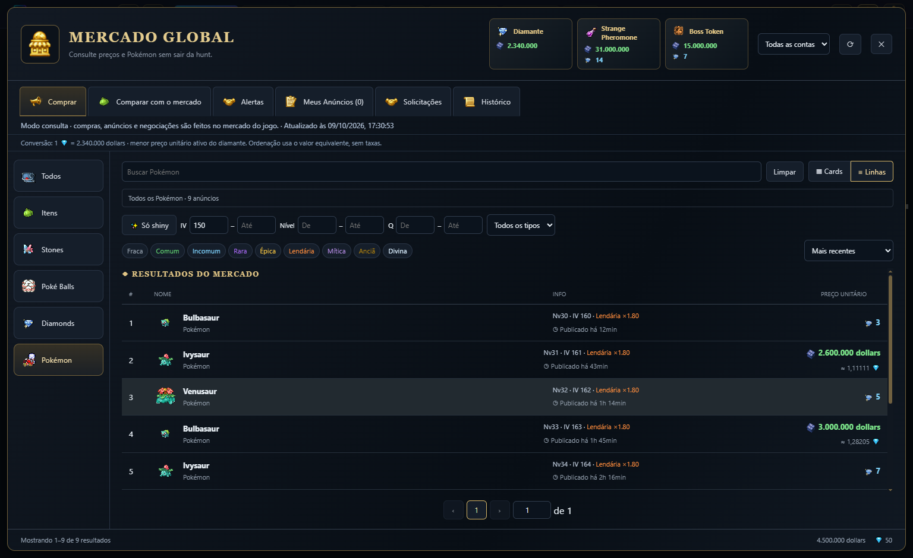
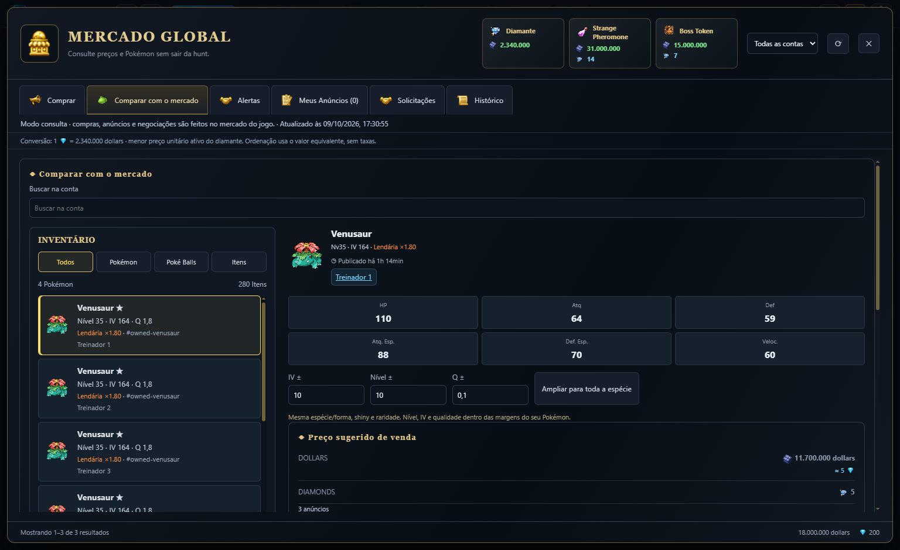
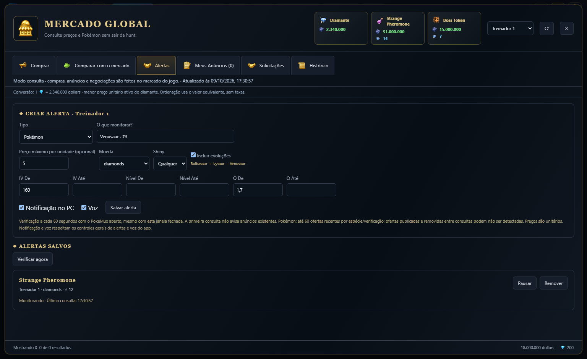

<div align="center">


# PokeMux

**Up to four isolated Poke Idle World accounts, dashboards and local tools in one Windows app.**

[Download for Windows](https://github.com/Diego-ops501/PokeMux/releases/latest) · [Português](README.md) · [License](LICENSE)

</div>

> Independent community project. CAPTCHA and 2FA always require manual completion.

## Credits

**PokeMux** is derived from **[soufoka/PokeGrid-source](https://github.com/soufoka/PokeGrid-source)** and preserves its MIT license, history and credits. The original PokeGrid supplied the four-account grid, isolated sessions, assisted login, Eco mode, dashboards, Hunt Analyzer, history, tier list, Ditto tools and many quality-of-life features.

PokeMux adds a Windows installer and updater, hardened storage and navigation, local overlays, confirmed Poké Ball purchases, optional return to the same hunt, spoken alerts and a repaired bundled IV calculator. Its compact top bar uses the full window width for the game grid. See [NOTICE.md](NOTICE.md) for third-party acknowledgements.

## Highlights

- Global Market automatically uses an available connected account. Inventories and personal listings from up to four accounts are combined, with an account filter and owner links that open the corresponding panel. Open market data refreshes every 60 seconds while preserving filters and scroll; the complete Pokémon cache refreshes approximately every five minutes.
- Inventory list identifies each specimen by name, level, IV, quality, rarity and owner. Comparisons require the same rarity and adjustable level, IV and quality tolerances. Selling estimates use complete comparable sets; no matching listings means no reliable estimate. Whole-species references require explicit widening.
- Pokémon browsing opens all listings directly. Price sorting converts dollars and diamonds using the active Diamond quote and loads only the pages needed. The wider window includes hover IV calculation and prioritizes visible queries over background synchronization.
- Header cards for the lowest Diamond price in dollars, Strange Pheromone and Bronze Boss Token prices in both currencies.
- Up to 10 local market alerts per account/character, autocomplete search, maximum unit price and Pokémon conditions. Windows notifications and local speech; checks every 60 seconds while the app runs, even with the market window closed. The first check is silent and repeat listings are deduplicated.
- Include evolutions and pre-evolutions from the game's catalog in Pokémon searches and alerts. The search checkbox is inside the Pokémon filters, with sorting beside quality options above results.
- Compact top bar: support and referral on the left; IV, Market and Options artwork on the right, with Options last. Game Menu and Overlay use text buttons.
- Hard limit of four persistent, isolated accounts.
- Assisted auto-login with credentials protected by Electron `safeStorage`/Windows DPAPI.
- Dashboard, Simple mode, history, gold/XP/kills metrics, overkill, ETA and hunt recommendations.
- Hunt Analyzer, tier list, Ditto analysis, inventory and IV calculator.
- Windows, popup and Discord alerts; optional local shiny screenshot.
- Local Windows speech for successful shiny captures, low Poké Ball/potion supplies, rare drops, IV 160+ or Legendary-quality captures and configured market alerts.
- Read-only floating overlay.
- One-shot Poké Ball purchases with account, quantity, total cost and balance confirmation.
- Experimental return to the same hunt after reload, off by default and limited to three attempts.
- Confirmed updates with SHA-512 validation; no silent download or installation.

The app does not solve CAPTCHA, automate 2FA, load arbitrary userscripts, rotate hunts, auto-sell or add refill loops.

## Run from source

```powershell
git clone https://github.com/Diego-ops501/PokeMux.git
cd PokeMux
npm ci
npm test
npm start
```

Build the Windows x64 NSIS installer with `npm run dist`.

Run `npm run test:market-refresh` for the real Electron renderer refresh test. `npm run docs:market` renders the following screenshots with fictional data and no access to saved accounts.

## New market screens







These are demonstrations with fictional prices. Purchases and negotiations take place in the game. See the [manual](MANUAL.md) for monitoring limits and sample details.

## Security

- Sandboxed windows with context isolation and no Node.js access.
- Game panels are restricted to the official game origin.
- Credentials never enter logs, backups or exports.
- The bundled IV helper only loads after login; remote userscripts remain disabled.
- CAPTCHA, Cloudflare Turnstile and 2FA remain manual.

## Documentation and license

- [Manual](MANUAL.md)
- [FAQ](FAQ.md)
- [Changelog](CHANGELOG.md)
- [Third-party notices](NOTICE.md)
- [MIT license](LICENSE)

PokeMux is not affiliated with Poke Idle World, Nintendo, The Pokémon Company or Game Freak.
