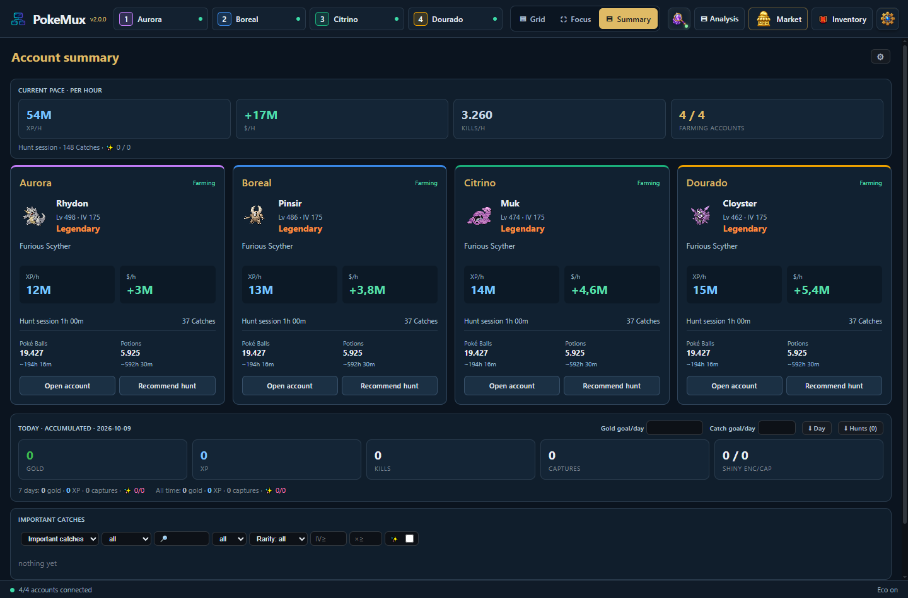
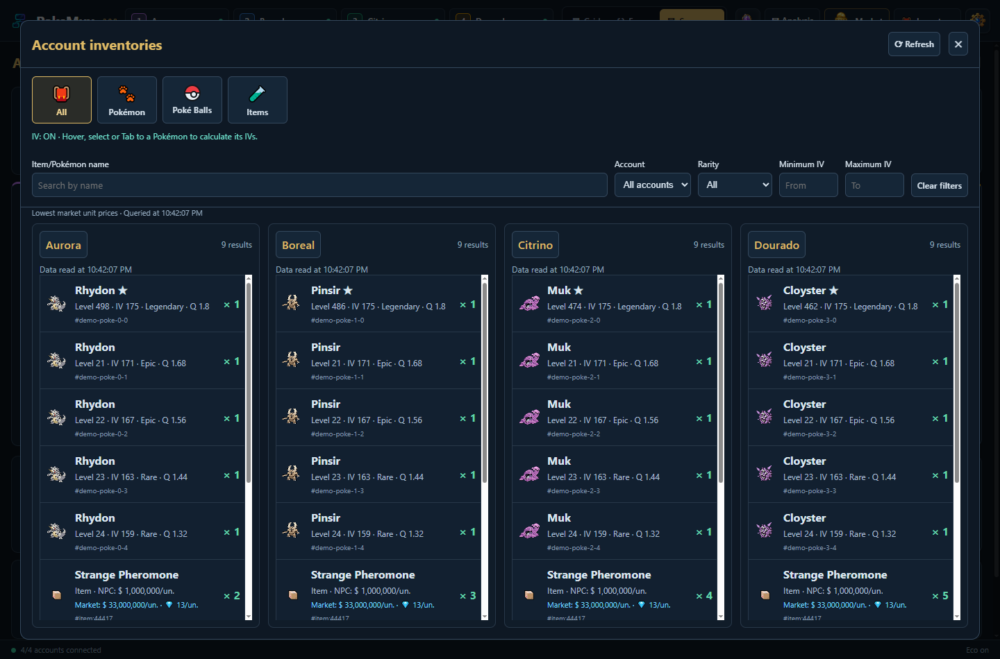
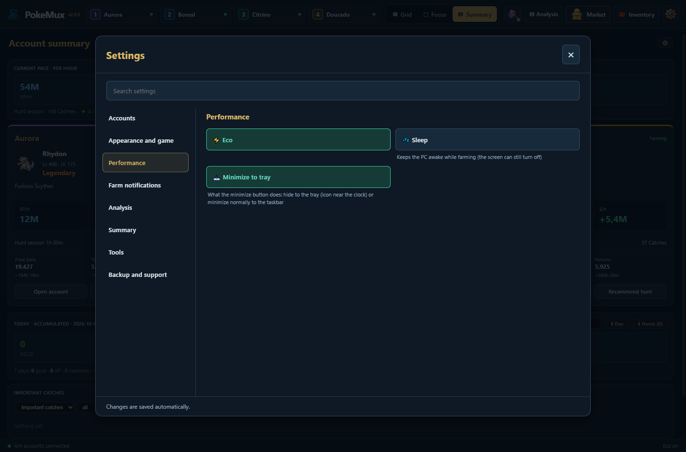

<div align="center">


# PokeMux 2.0

**Up to four isolated Poke Idle World accounts in one Windows app.**

[Português](README.md) · [English](README.en.md) · [Español](README.es.md)

[Download for Windows](https://github.com/Diego-ops501/PokeMux/releases/latest) · [English guide](MANUAL.en.md) · [Changelog](CHANGELOG.md) · [MIT license](LICENSE)


</div>

## What's new in 2.0

- **Grid, Focus and Summary**, real account names and mode changes that preserve game sessions.
- **Summary** with side-by-side account cards: active Pokémon, level, IV, rarity, hunt, XP/hour, dollars/hour, catches and supplies. Highlights disconnected or idle accounts and low stock; important catches appear first.
- **Open account** opens the game and its Analysis. **Recommend hunt** uses that account's Pokémon; traveling keeps the current screen. Entering Summary collapses Analysis until you click to open it.
- **Inventory** in a centered window, one column per connected account, pictures and All/Pokémon/Poké Balls/Items categories. Filter by name, account, rarity and IV. Pokémon sort by rarity then IV; items by NPC unit value.
- **Inventory IV calculation** on hover, selection or Tab, using the owner's session. Items show the lowest Global Market unit price below the NPC price; unavailable or stale quotes are identified.
- **Settings** in a searchable central panel. Market alerts remain inside Market.
- **Performance**: shared state reads, local filters and caches; live Summary updates preserve focus and scrolling. Eco uses 15 FPS for the visible game, 2 FPS outside focus and 1 FPS in Summary.
- One installer supports **Português, English and Español**. Choose **Settings → Appearance and game → PT / EN / ES**. The embedded game supports PT/EN; Spanish uses English for the game itself.

## Inventory



Inventory loads on opening and when you click **Refresh**. Filtering is local. Partial data, disconnected accounts and failed updates are marked; inventory is not continuously refreshed during farming.

## Settings



Accounts, appearance, performance, farm notifications, analysis, summary, tools and backup/support. Changes save automatically.

## Global Market


An available connected account provides market access. Inventories and personal listings from four accounts are combined, with owner filters and links to each account. Price sorting compares dollars and diamonds using the active Diamond quote. Shared caches and a request queue respect game limits. The open market refreshes every 60 seconds; the complete Pokémon cache refreshes approximately every five minutes.

Comparisons require the same species/form, shiny status and rarity, with adjustable IV, level and quality margins. Results show lowest unit price, median, buy requests and sample size. No complete comparables means no reliable selling estimate. Widening to the entire species requires an explicit click. Prices exclude fees; listings and requests are not records of completed sales.

Save up to 10 alerts per account/character, filtered by name, price and Pokémon conditions. Checks run every 60 seconds while the app is open, even with Market closed. Silent initial baseline, deduplication, Windows notifications and local speech. Buy and negotiate in the game market.

*Screenshots use the actual app with fictional data. Summary, Inventory and Settings images above are in English; the Market demonstration is in Portuguese. The app's Market supports English too.*

## Other tools

Hunt Analyzer, hunt rankings, tier list, Ditto tools, history, goals, pinned items and a read-only floating overlay. XP-focused recommendations consider only XP; dollar-focused recommendations consider net income. Configurable spoken/Windows alerts for special catches, rare drops and low supplies, plus an optional user-owned Discord webhook.

## Install and security

Download the x64 installer from [Releases](https://github.com/Diego-ops501/PokeMux/releases/latest). Windows 10/11; no Node.js needed. Updates preserve settings, history and sessions. The executable is not code-signed; Windows SmartScreen may warn on first launch.

Four isolated persistent sessions, credentials protected by Electron `safeStorage`/Windows DPAPI, sandbox and context isolation. Backups exclude passwords and the webhook. CAPTCHA and 2FA stay manual. Updates require confirmation and validate SHA-512. No automatic Poké Ball purchases, refill, automatic selling or CAPTCHA solving.

## Run from source

```powershell
git clone https://github.com/Diego-ops501/PokeMux.git
cd PokeMux
npm ci
npm test
npm run test:workspace
npm run test:inventory
npm run test:market-refresh
npm start
```

Requires Git and Node.js LTS. `npm run dist` builds the Windows x64 NSIS installer in `dist/`. `npm run docs:ui` generates PT/EN/ES screenshots using fictional data in an isolated profile; `npm run docs:market` generates market screenshots. See the [English guide](MANUAL.en.md), [Portuguese manual](MANUAL.md), [FAQ](FAQ.md) and [Changelog](CHANGELOG.md).

## Credits and license

Independent community project, unaffiliated with Poke Idle World, Nintendo, The Pokémon Company or Game Freak. Derived from **[soufoka/PokeGrid-source](https://github.com/soufoka/PokeGrid-source)**; original history, MIT license and credits are preserved. PokeGrid supplied the grid, isolated sessions, assisted login, Eco, analysis and history. Some ideas were inspired by [Poke Idle Launcher](https://github.com/AntonioFleck/poke-idle-launcher). The JustPokédex IV helper is bundled locally. See [LICENSE](LICENSE) and [NOTICE.md](NOTICE.md).
