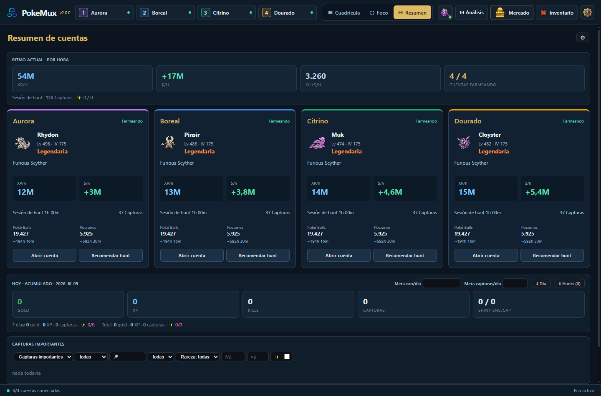
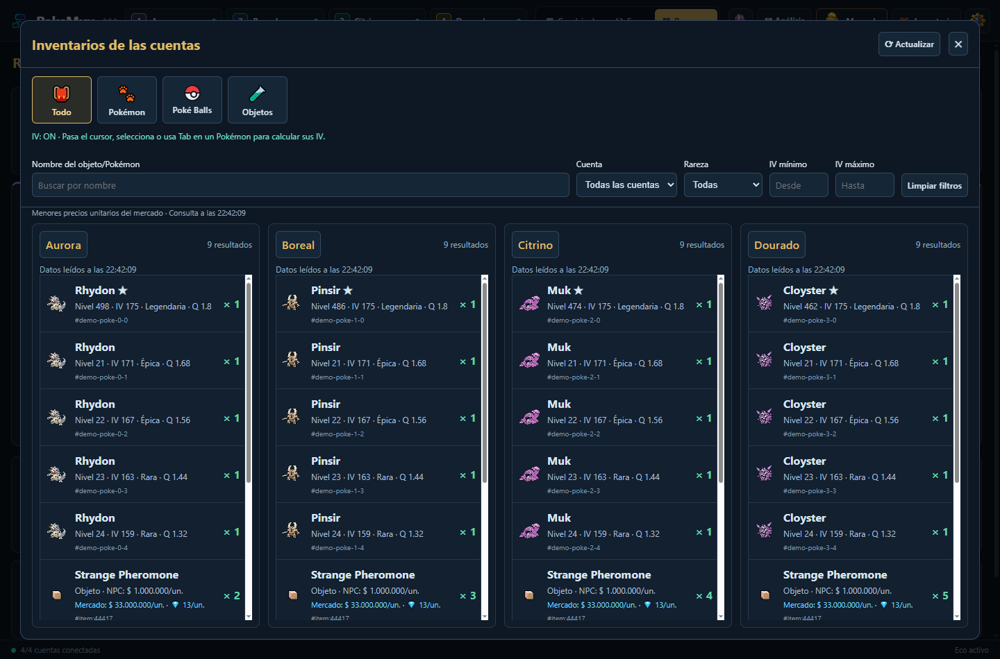
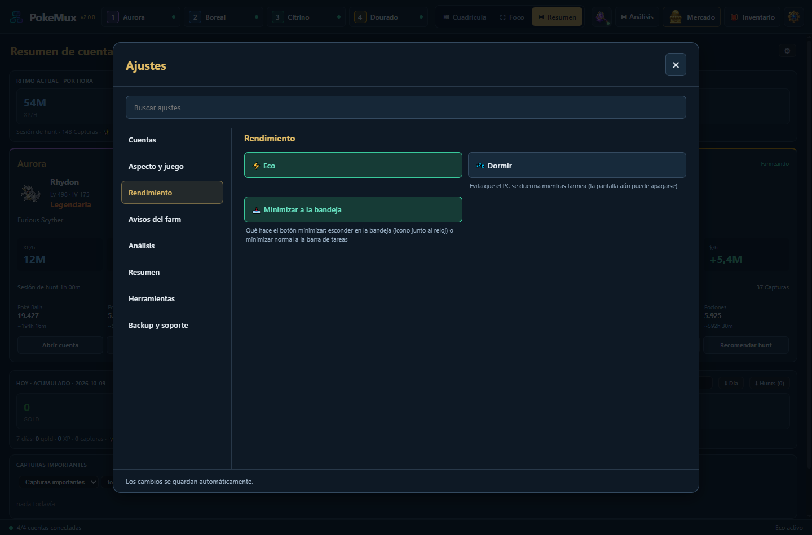

<div align="center">


# PokeMux 2.0

**Hasta cuatro cuentas aisladas de Poke Idle World en una aplicación para Windows.**

[Português](README.md) · [English](README.en.md) · [Español](README.es.md)

[Descargar para Windows](https://github.com/Diego-ops501/PokeMux/releases/latest) · [Guía en español](MANUAL.es.md) · [Cambios](CHANGELOG.md) · [Licencia MIT](LICENSE)


</div>

## Novedades de la versión 2.0

- **Cuadrícula, Foco y Resumen**, con nombres reales de las cuentas y cambios de pantalla que conservan las sesiones del juego.
- **Resumen** con tarjetas de cuentas en columnas: Pokémon activo, nivel, IV, rareza, hunt, XP/h, dólares/h, capturas y suministros. Destaca cuentas desconectadas o inactivas y existencias bajas; las capturas importantes aparecen primero.
- **Abrir cuenta** abre el juego y su Análisis. **Recomendar hunt** usa el Pokémon de esa cuenta; viajar mantiene la pantalla actual. Entrar al Resumen cierra el Análisis hasta que hagas clic para abrirlo.
- **Inventario** centrado, una columna por cuenta conectada, imágenes y categorías Todo/Pokémon/Poké Balls/Objetos. Filtros por nombre, cuenta, rareza e IV. Pokémon ordenados por rareza e IV; objetos por valor unitario NPC.
- **Cálculo de IV en el inventario** al pasar el cursor, seleccionar o usar Tab, con la sesión de la cuenta propietaria. Los objetos muestran el menor precio unitario del Mercado Global debajo del precio NPC; las consultas antiguas o no disponibles se identifican.
- **Ajustes** en un panel central con búsqueda. Las alertas del mercado están dentro de Mercado.
- **Rendimiento**: lecturas compartidas, filtros locales y cachés; las actualizaciones del Resumen conservan el foco y el desplazamiento. Eco usa 15 FPS en el juego visible, 2 FPS fuera de foco y 1 FPS en el Resumen.
- Un instalador con **Português, English y Español**. Elige **Ajustes → Aspecto y juego → PT / EN / ES**. El juego integrado dispone de PT/EN; para español utiliza inglés dentro del juego.

## Inventario



Se consulta al abrir y al pulsar **Actualizar**. Los filtros son locales. Datos parciales, cuentas desconectadas y actualizaciones fallidas se indican; el inventario no se actualiza continuamente durante el farm.

## Ajustes



Cuentas, aspecto, rendimiento, avisos del farm, análisis, resumen, herramientas y backup/soporte. Los cambios se guardan automáticamente.

## Mercado Global


Una cuenta conectada disponible proporciona acceso. Se reúnen inventarios y anuncios personales de las cuatro cuentas, con filtro por propietario y enlaces a cada cuenta. La ordenación compara dollars y diamonds usando la cotización activa del diamante. Cachés y una cola compartida respetan los límites del juego. El mercado abierto se actualiza cada 60 segundos; la caché completa de Pokémon, aproximadamente cada cinco minutos.

La comparación exige la misma especie/forma, condición shiny y rareza, con márgenes ajustables de IV, nivel y calidad. Muestra menor precio unitario, mediana, solicitudes de compra y tamaño de muestra. Sin datos comparables completos no propone un precio fiable. Ampliar a toda la especie requiere un clic explícito. Los precios no incluyen tasas; anuncios y solicitudes no prueban ventas realizadas.

Hasta 10 alertas por cuenta/personaje, con filtros de nombre, precio y condiciones del Pokémon. Consultas cada 60 segundos mientras la aplicación está abierta, incluso con Mercado cerrado. Primera consulta silenciosa, deduplicación, notificaciones de Windows y voz local. Las compras y negociaciones se realizan en el juego.

*Las imágenes muestran la interfaz real con datos ficticios. Resumen, Inventario y Ajustes están en español; la demostración del Mercado está en portugués. El Mercado de la aplicación también admite español.*

## Otras herramientas

Hunt Analyzer, ranking de hunts, tierlist, Ditto, historial, metas, objetos fijados y overlay de solo lectura. Recomendaciones enfocadas en XP consideran solo XP; las enfocadas en dólares consideran ingresos netos. Avisos de voz/Windows para capturas especiales, drops raros y suministros bajos, con preferencias y webhook Discord opcional del usuario.

## Instalación y seguridad

Descarga el instalador x64 en [Releases](https://github.com/Diego-ops501/PokeMux/releases/latest). Windows 10/11; no requiere Node.js. Las actualizaciones conservan ajustes, historial y sesiones. El ejecutable no está firmado; SmartScreen puede mostrar un aviso al iniciarlo por primera vez.

Cuatro sesiones persistentes aisladas, credenciales protegidas con `safeStorage`/DPAPI de Windows, sandbox y aislamiento de contexto. Los backups excluyen contraseñas y webhook. CAPTCHA y 2FA son manuales. Las actualizaciones requieren confirmación y validan SHA-512. No incluye compras automáticas de Poké Balls, refill, ventas automáticas ni resolución de CAPTCHA.

## Ejecutar el código

```powershell
git clone https://github.com/Diego-ops501/PokeMux.git
cd PokeMux
npm ci
npm test
npm run test:workspace
npm run test:inventory
npm run test:market-refresh
npm start
```

Requiere Git y Node.js LTS. `npm run dist` genera el instalador Windows x64 NSIS en `dist/`. `npm run docs:ui` recrea imágenes PT/EN/ES con datos ficticios y perfil aislado; `npm run docs:market` genera imágenes del mercado. Consulta la [guía en español](MANUAL.es.md), el [manual en portugués](MANUAL.md), las [FAQ](FAQ.md) y los [cambios](CHANGELOG.md).

## Créditos y licencia

Proyecto comunitario independiente, sin relación oficial con Poke Idle World, Nintendo, The Pokémon Company o Game Freak. Derivado de **[soufoka/PokeGrid-source](https://github.com/soufoka/PokeGrid-source)**; conserva el historial, licencia MIT y créditos originales. PokeGrid aportó la cuadrícula, sesiones aisladas, login asistido, Eco, análisis e historial. Algunas ideas se inspiraron en [Poke Idle Launcher](https://github.com/AntonioFleck/poke-idle-launcher). El helper IV JustPokédex se incluye localmente. Consulta [LICENSE](LICENSE) y [NOTICE.md](NOTICE.md).
