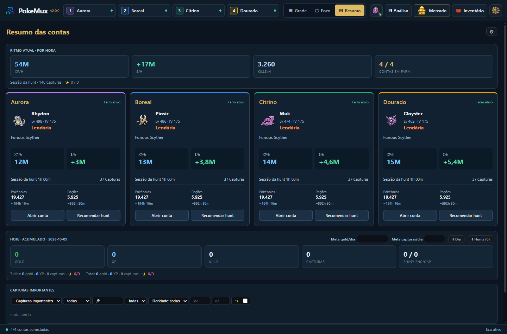
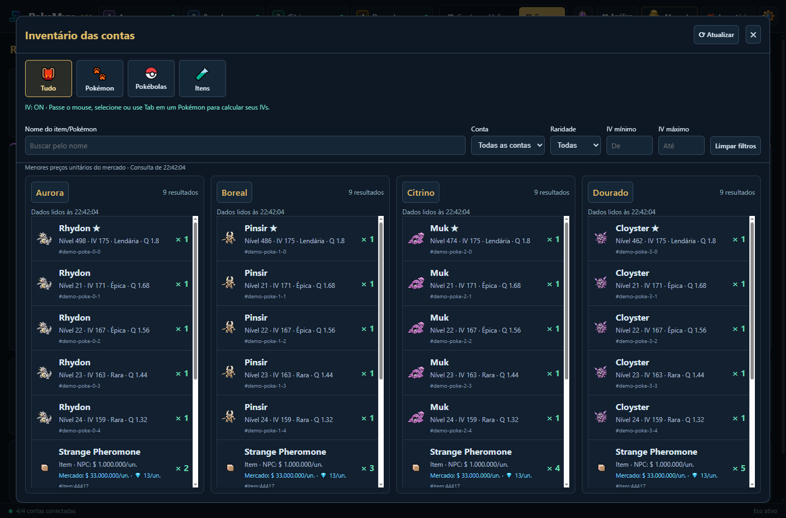
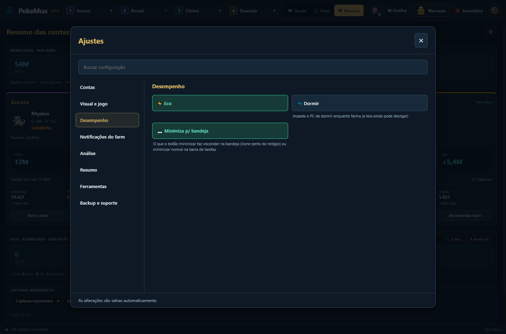

<div align="center">


# PokeMux 2.0

**Até quatro contas de Poke Idle World em uma janela, com sessões isoladas e ferramentas locais.**

[Português](README.md) · [English](README.en.md) · [Español](README.es.md)

[](https://github.com/Diego-ops501/PokeMux/releases/latest)
[](https://github.com/Diego-ops501/PokeMux/releases/latest)
[](LICENSE)

[Baixar para Windows](https://github.com/Diego-ops501/PokeMux/releases/latest) · [Manual](MANUAL.md) · [FAQ](FAQ.md) · [Changelog](CHANGELOG.md)


</div>

## Novidades da versão 2.0

- **Grade, Foco e Resumo**, com nomes reais das contas e troca de tela preservando as sessões.
- **Resumo** com cartões lado a lado: Pokémon ativo, nível, IV, raridade, hunt, XP/h, dólares/h, capturas e suprimentos. Contas paradas ou desconectadas e estoques baixos ficam em destaque. Capturas importantes vêm primeiro.
- **Abrir conta** abre o jogo e sua Análise; **Recomendar hunt** sugere hunts para aquela conta. Ir para uma hunt mantém a tela atual. Entrar no Resumo recolhe a Análise, que só reabre por clique.
- **Inventário** centralizado, com as contas em colunas, imagens e categorias Tudo/Pokémon/Pokébolas/Itens. Filtros por nome, conta, raridade e IV; Pokémon ordenados por raridade e IV, itens pelo valor unitário NPC.
- **IV no inventário**: passe o mouse, selecione ou use Tab num Pokémon. Itens mostram o menor preço do Mercado Global abaixo do preço NPC, com identificação de cotações antigas ou indisponíveis.
- **Ajustes** centralizados, com busca e categorias. Os alertas da loja ficam dentro do Mercado.
- **Desempenho**: leituras de estado compartilhadas, filtros locais, caches e atualização do Resumo preservando foco e rolagem. Eco usa 15 FPS no jogo visível, 2 FPS fora de foco e 1 FPS no Resumo.
- **Português, English e Español** no mesmo instalador. Escolha em **Ajustes → Visual e jogo → PT / EN / ES**. A interface do jogo usa seus idiomas disponíveis: PT ou EN; ES usa EN dentro do jogo.

## Inventário das quatro contas



O inventário é consultado ao abrir e ao clicar em **Atualizar**. Filtros e ordenação são locais; a calculadora usa a sessão da conta dona do Pokémon. Dados parciais, desconectados ou antigos são identificados.

## Ajustes



Contas, visual, desempenho, notificações, análise, resumo, ferramentas e backup/suporte em um painel com busca. Alterações são salvas automaticamente.

## Mercado Global


O mercado usa uma conta conectada disponível. Inventários e anúncios pessoais das quatro contas são reunidos, com filtro por dono e links para sua tela. A ordenação de preço converte dollars e diamonds pela cotação ativa; consultas têm cache e fila compartilhada para respeitar os limites do jogo. O mercado aberto atualiza a cada 60 segundos; o cache completo de Pokémon tem atualização aproximada de cinco minutos.


**Comparar com o mercado** considera espécie/forma, shiny, raridade e margens de IV, nível e qualidade. Mostra menor preço, mediana, solicitações de compra e amostra. Sem comparáveis completos, não sugere um preço confiável. Ampliar para toda a espécie é uma ação explícita. Preços são unitários antes das taxas; anúncios não comprovam vendas concluídas.


Até 10 alertas por conta/personagem, com nome, preço e condições. O monitor consulta a cada 60 segundos enquanto o app está aberto, mesmo com o mercado fechado. Primeira consulta silenciosa, deduplicação, notificações do Windows e voz local. Compras e negociações são feitas no jogo.

*Todas as imagens desta página usam a interface real e dados fictícios.*

## Outras ferramentas

Hunt Analyzer, ranking de hunts, tierlist, Ditto, histórico, metas, itens fixados e overlay somente-leitura. Recomendações com foco em XP avaliam apenas XP; foco em dólares avalia rendimento líquido. Voz e notificações para capturas especiais, drops raros e suprimentos, com preferências individuais e webhook Discord opcional.

## Instalação e segurança

Baixe o instalador x64 em [Releases](https://github.com/Diego-ops501/PokeMux/releases/latest). Windows 10/11; Node.js não é necessário. As atualizações preservam configurações, histórico e sessões. O executável não possui certificado de assinatura de código; SmartScreen pode avisar na primeira execução.

Quatro sessões persistentes isoladas; credenciais protegidas por `safeStorage`/DPAPI do Windows. Sandbox e `contextIsolation` ativos. Backups não incluem senhas ou webhook. CAPTCHA e 2FA são manuais. Atualizações exigem confirmação e verificam SHA-512. O app não inclui compra automática de Pokébolas, refill, venda automática nem resolução de CAPTCHA.

## Código e testes

```powershell
git clone https://github.com/Diego-ops501/PokeMux.git
cd PokeMux
npm ci
npm test
npm run test:workspace
npm run test:inventory
npm run test:market-refresh
npm start
```

Requer Git e Node.js LTS. `npm run dist` gera o instalador NSIS x64 em `dist/`. `npm run docs:ui` e `npm run docs:market` recriam as imagens com dados fictícios e perfil separado. As primeiras imagens são geradas em PT, EN e ES. Consulte [CHANGELOG.md](CHANGELOG.md), [MANUAL.md](MANUAL.md) e [FAQ.md](FAQ.md).

## Origem e licença

Projeto comunitário independente, sem vínculo com Poke Idle World, Nintendo, The Pokémon Company ou Game Freak. Derivado de **[soufoka/PokeGrid-source](https://github.com/soufoka/PokeGrid-source)**, mantendo o histórico, licença MIT e créditos. A base forneceu a grade, sessões isoladas, login assistido, Eco, análises e histórico. Algumas ideias foram inspiradas pelo [Poke Idle Launcher](https://github.com/AntonioFleck/poke-idle-launcher). O helper de IV JustPokédex é distribuído localmente. Veja [LICENSE](LICENSE) e [NOTICE.md](NOTICE.md).
