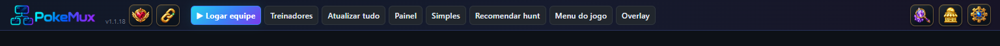
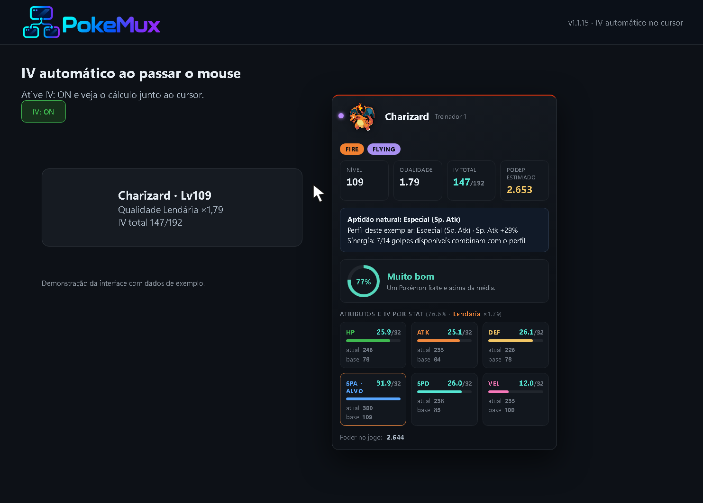

<div align="center">


# PokeMux

**Até quatro contas de Poke Idle World em uma janela, com sessões isoladas, painel completo e ferramentas locais.**

[](https://github.com/Diego-ops501/PokeMux/releases/latest)
[](package.json)
[](LICENSE)
[](https://github.com/Diego-ops501/PokeMux/releases/latest)

[Baixar para Windows](https://github.com/Diego-ops501/PokeMux/releases/latest) · [Manual](MANUAL.md) · [FAQ](FAQ.md) · [Changelog](CHANGELOG.md)


*Mercado Global — demonstração com dados fictícios; os preços reais são consultados na conta conectada.*

</div>

> Projeto comunitário e independente, sem vínculo com Poke Idle World, Nintendo, The Pokémon Company ou Game Freak. O uso deve respeitar as regras atuais do jogo. CAPTCHA e 2FA são sempre resolvidos manualmente.

## Origem e créditos

O **PokeMux** deriva do projeto open source **[PokeGrid](https://github.com/soufoka/PokeGrid-source)**, criado e mantido por **soufoka** sob licença MIT. O histórico original, a licença e os créditos foram preservados.

A base do PokeGrid forneceu a grade de quatro contas, sessões separadas, login assistido, modo Eco, painel, Hunt Analyzer, métricas, histórico, tierlist, Ditto e várias melhorias de qualidade de vida. O PokeMux preserva essa base e adiciona identidade visual, empacotamento, segurança, interface, atualizações e alertas próprios.

Algumas ideias de interface e leitura de eventos também foram inspiradas pelo [Poke Idle Launcher](https://github.com/AntonioFleck/poke-idle-launcher), igualmente MIT. Consulte [NOTICE.md](NOTICE.md) para os avisos completos.

## Recursos

### Mercado Global, comparação e alertas

Abra o mercado pelo ícone dourado no topo, selecione a conta e consulte itens e Pokémon sem sair da hunt. A janela atualiza os dados automaticamente a cada **60 segundos**, preservando sua busca, filtros, ordenação, página, seleção e rolagem. Os cards do cabeçalho mostram os menores preços de Diamante, Strange Pheromone e Bronze Boss Token.

Na busca de Pokémon, filtre shiny, IV, nível, qualidade, tipo e raridade. **Incluir evoluções**, dentro dos filtros, inclui também pré-evoluções: Venusaur reúne Bulbasaur e Ivysaur. A ordenação fica junto às qualidades, acima dos resultados; anúncios mostram o tempo de publicação quando informado pelo jogo.


**Comparar com o mercado** reúne os inventários das contas, com filtro por dono, para selecionar um bem e consultar menor preço, mediana dos anúncios consultados e maior solicitação de compra, separados por moeda. Pokémon são comparados pela mesma raridade e margens ajustáveis de IV, nível e qualidade. Sem semelhantes, o app não usa outros níveis como preço sugerido. O resumo informa o tamanho da amostra; solicitações são intenções de compra, sem histórico global de vendas concluídas.


Salve até **10 alertas** por conta/personagem, com busca por nome, preço máximo unitário, moeda e condições de Pokémon, incluindo sua cadeia de evolução. O monitor consulta a cada 60 segundos enquanto o app está aberto, mesmo com a janela do mercado fechada, e avisa pelo Windows e pela voz do app. A primeira consulta estabelece uma referência silenciosa; anúncios repetidos não geram novos avisos. Consulte as condições e limites no [manual](MANUAL.md#alertas-do-mercado-global).

*Imagens de comparação e alertas renderizadas pela interface do app com dados fictícios. Compras e negociações são feitas no mercado do jogo.*



*Ajude o projeto e Referral juntos à esquerda; IV, Mercado e Opções à direita, com Opções sempre no fim.*

### IV automático no cursor

Ative **IV: ON** e passe o mouse sobre um Pokémon. O resultado aparece junto ao cursor, com IV por atributo, qualidade, poder e aptidão.



*Demonstração da interface com dados de exemplo.*

### Modo Simples


### Quatro contas e login

- Uma a quatro contas simultâneas, com teto rígido na interface e no processo principal.
- Partição persistente e isolada para cada conta.
- Login automático somente na página oficial do jogo.
- Credenciais criptografadas pelo `safeStorage`/DPAPI do Windows, sem fallback em texto puro.
- Reconexão e novo preenchimento quando uma sessão expira.
- CAPTCHA, Cloudflare Turnstile e 2FA permanecem manuais; o aplicativo apenas aguarda a validação feita pelo usuário.

### Interface e acompanhamento

- Interface compacta sem barra lateral fixa, aproveitando toda a largura para as telas do jogo.
- Barra superior com acesso direto ao Dashboard, Painel, Overlay, calculadora de IV e controles operacionais.
- Ícone do Mercado Global no topo: consulta automática sem sair da hunt, com busca direta de Pokémon, filtros, preço convertido e cálculo de IV. Inventários e anúncios das quatro contas são reunidos, com filtro por conta e atalhos para o painel do dono. Comparar com o mercado permite selecionar bens da conta e consultar preços semelhantes e solicitações de compra em dollars e diamonds, com margens ajustáveis e indicação da amostra consultada. A aba Alertas salva até 10 regras de preço e condições, consulta novos anúncios a cada 60 segundos e avisa pelo Windows e pela voz do app, inclusive com a janela do mercado fechada. Comprar, Meus Anúncios, Solicitações e Histórico da conta ficam disponíveis para consulta; negociações são feitas no mercado do jogo.
- Grade, foco individual, uma coluna ou uma linha.
- Modo Simples de baixo consumo, mantendo o farm do servidor ativo.
- Overlay flutuante somente-leitura, individual ou agregado.
- Estados de conexão claros e central de alertas.
- Histórico de capturas, shinies, hunts, drops e resumos diários.
- Exportação de configurações e histórico sem credenciais ou webhook.

### Métricas e análises

- Gold/h líquido, XP/h, kills/h, capturas, gasto de Pokébolas e suprimentos.
- Overkill, golpes por abate, dano relativo e ETA de nível/metas.
- Recomendação de hunt usando medições da própria conta.
- Botão **Recomendar hunt** para o Pokémon principal de cada conta, com tipos, golpes, ataque, HP, defesas, nível, risco estimado e medições de XP/h; entrada na opção escolhida com um clique e confirmação do jogo.
- Melhor hunt do **Tipo do Dia** em uma seção separada, com borda na cor do tipo, bônus de XP/loot e término do evento informados pelo jogo.
- Hunt Analyzer, ranking de hunts, tierlist e painel especializado para Ditto.
- Mochila por categoria, itens fixados, equipe, patrimônio e acompanhamento de alvo shiny.
- IV automático ao passar o mouse sobre um Pokémon, com resultado junto ao cursor, atributos, poder e classificação de potencial; botão IV: ON/OFF com preferência salva.
- Helper de IV fixo e auditável, carregado somente depois do login; não há carregamento de userscripts externos.

### Alertas

- Popup, notificação do Windows, Discord e captura de tela local opcional para shiny.
- Acordes sintetizados ou voz local instalada no Windows.
- Voz informando a conta e o item, além da notificação, ao obter **Strange Pheromones** ou **Boss Token**, com opção individual para desativar.
- Voz para:
  - captura de shiny concluída com sucesso;
  - captura de Pokémon com IV 160 ou mais, informando IV e raridade;
  - Pokébolas e poções acabando, com nome da conta e quantidade;
  - Strange Pheromones ou Boss Token, com nome da conta e do item;
  - captura exatamente na faixa de qualidade **Lendária** (`1,7 ≤ qualidade < 2,0`), informando também o IV.
- Voz e notificações do Windows não avisam a aparição nem a falha de captura de shiny. Capturas com IV 160+ ou raridade Lendária recebem uma única mensagem com conta, Pokémon, IV e raridade.
- Fila e deduplicação impedem uma avalanche de falas quando várias contas alertam juntas.
- Mítica, Anciã e Divina não são anunciadas incorretamente como Lendária.
- Webhook opcional do próprio usuário, com fila e tratamento de limite do Discord.

### Ações mantidas

- Compra pontual de Pokébolas, sempre com confirmação de conta, tipo, quantidade, custo total e saldo.
- Proteção contra quantidade inválida, saldo insuficiente, conta offline e resposta duplicada.
- Venda protegida para shiny, qualidade alta e itens definidos pelo usuário.
- Retorno experimental à mesma hunt após recarregamento, desligado por padrão, com slug validado, intervalo de 12 segundos e no máximo três tentativas.

O aplicativo não inclui refill automático, venda automática, rotação de hunts, resolução de CAPTCHA ou novas ações repetitivas. As ações de jogo são o login assistido, a compra confirmada de Pokébolas, a entrada pontual em uma hunt recomendada escolhida pelo usuário e o retorno experimental à mesma hunt.

## Instalação no Windows

Baixe o instalador x64 em [Releases](https://github.com/Diego-ops501/PokeMux/releases/latest). Ele inclui o runtime necessário; não é preciso instalar Node.js.

O executável ainda não possui certificado pago de assinatura de código. Por isso, o Windows SmartScreen pode exibir um aviso na primeira execução. As configurações, sessões e históricos ficam no perfil do Windows e são preservados durante atualizações e reinstalações.

## Atualizações

- Consulta automática no máximo uma vez por dia.
- Exibe versão, changelog e tamanho antes de baixar.
- Download somente após confirmação.
- Integridade validada pelo SHA-512 do `latest.yml`.
- Reinício e instalação nunca são silenciosos.
- Releases também publicam checksums SHA-256 para conferência manual.

## Segurança e privacidade

- `contextIsolation` e sandbox ligados, Node.js desativado nas janelas.
- Navegação das contas restrita ao domínio oficial do jogo; links externos abrem no navegador padrão.
- Permissões de câmera, microfone, localização e notificações do jogo são negadas.
- Credenciais não entram em logs, backups ou exportações.
- Screenshot de shiny aceita somente o `webview` oficial e é armazenado localmente.
- Atualizador aceita somente HTTPS e o caminho oficial deste repositório.
- Código arbitrário de terceiros e userscripts remotos permanecem bloqueados.

## Executar a partir do código

Requer Node.js LTS e Git:

```powershell
git clone https://github.com/Diego-ops501/PokeMux.git
cd PokeMux
npm ci
npm test
npm start
```

Gerar o instalador NSIS x64:

```powershell
npm run dist
```

Os artefatos são criados em `dist/`. A suíte cobre inicialização, isolamento das quatro sessões, cofre, compra de bolas, retorno à hunt, coleta de métricas, voz, IV, mercado, comparação, evoluções, alertas e atualização. Use `npm run test:market-refresh` para testar a preservação da tela durante a atualização automática em um renderer Electron real. `npm run docs:market` recria as imagens do mercado com dados fictícios, sem acessar contas salvas.

## Estrutura

- `main.js`: processo principal, sessões, cofre, navegação, notificações e janelas.
- `preload.js`: ponte IPC de operações explicitamente permitidas.
- `index.html`: interface, contas, painel, alertas e coleta somente-leitura.
- `src/domain/`: cálculos isolados, incluindo IV.
- `src/main/`: gerenciador de atualização.
- `presets/justpokedex.js`: helper local e fixo da calculadora de IV.
- `test/`: testes automatizados.
- `scripts/`: publicação de releases.

## Documentação

- [Manual de uso](MANUAL.md)
- [Perguntas frequentes](FAQ.md)
- [Histórico de mudanças](CHANGELOG.md)
- [Créditos e avisos de terceiros](NOTICE.md)
- [Licença MIT](LICENSE)

## Licença

PokeMux é distribuído sob a licença MIT. A licença original do PokeGrid e os créditos de soufoka são preservados. Consulte [LICENSE](LICENSE) e [NOTICE.md](NOTICE.md).
